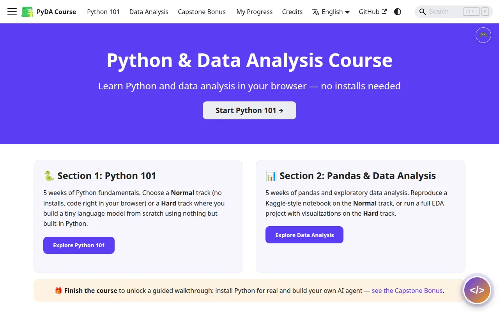
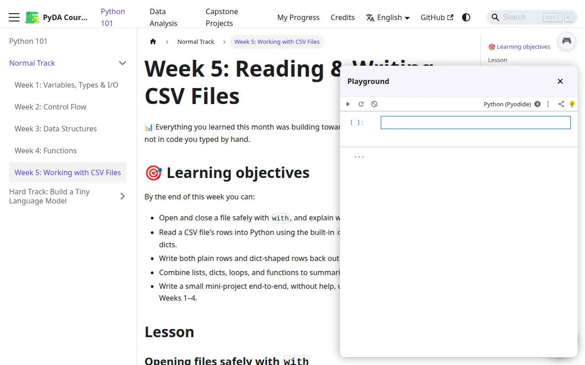
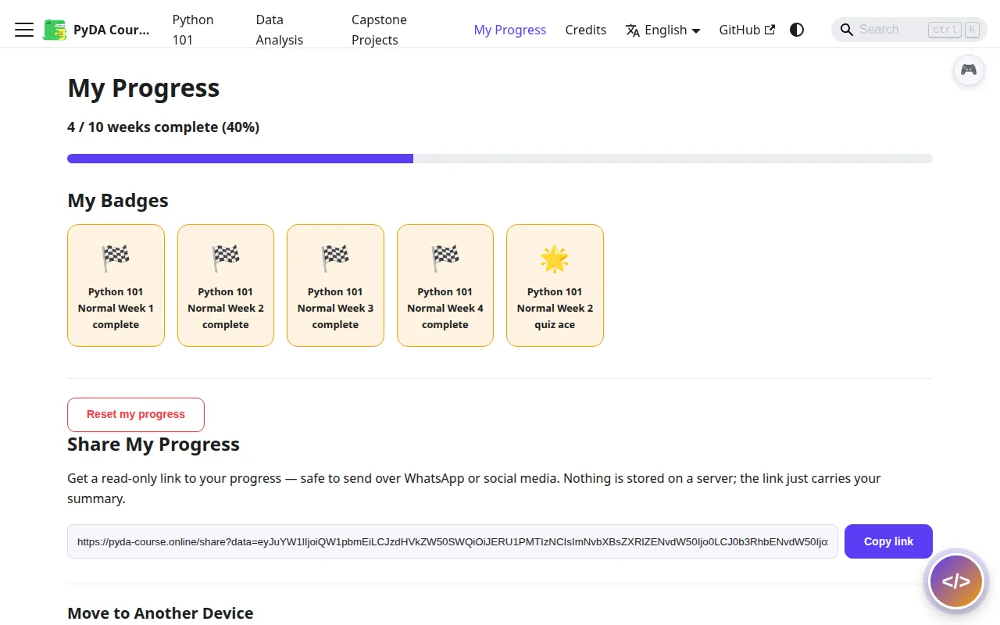
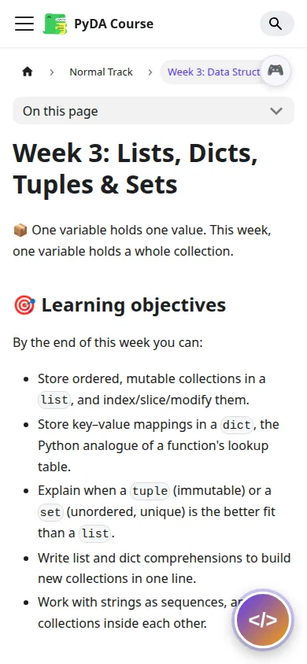

# Python & Data Analysis Course

[](https://github.com/abderrahim-lectures/python-data-analysis-course/actions/workflows/deploy.yml)
[](https://github.com/abderrahim-lectures/python-data-analysis-course/actions/workflows/ci.yml)
[](./LICENSE)
[](https://creativecommons.org/licenses/by/4.0/)
[](https://pyda-course.online/)
[](https://codespaces.new/abderrahim-lectures/python-data-analysis-course)

A free, browser-based Python and data analysis course — no installs required until you're ready to graduate to the real thing.

**🌐 [pyda-course.online](https://pyda-course.online/)**

- **Section 1: Python 101** (5 weeks) — fundamentals, with a Normal track and a Hard track (build a tiny language model from scratch, pure Python, deliberately no numpy).
- **Section 2: Pandas & Data Analysis** (5 weeks) — pandas basics reproducing a Kaggle-style notebook, with a Hard track doing a full exploratory data analysis project with visualizations.
- **Capstone bonus** — install Python locally for real with `uv` and build your first AI agent with LangChain's `deepagents`, using a free-tier API key.

Run entirely in the browser via an embedded Trinket editor (Python 101) and a self-hosted JupyterLite notebook (Data Analysis) — click the floating button on any page to start coding immediately, no account and no local install needed until the capstone.

See [`PLAN.md`](./PLAN.md) for the full design plan and rationale behind every major decision.

## Screenshots

| Homepage | Lesson + playground | Progress & badges | Mobile |
|---|---|---|---|
|  |  |  |  |

## Learning objectives

By the end of the course, a student can:

- Write Python programs using variables, control flow, data structures (lists, dicts, tuples, sets), and functions — without relying on classes or external libraries.
- Explain, from first principles, how a simple language model predicts text (tokenization → frequency counts → conditional probability → weighted sampling) by building one from scratch in pure Python (Hard track).
- Load, clean, filter, group, and aggregate real tabular data with pandas, and explain *why* vectorized tools exist by having personally measured pure Python's performance limits first.
- Run a complete, honest exploratory data analysis project — framing questions before charting, visualizing distributions and relationships appropriately, and stating a finding's confidence and caveats rather than overclaiming causation (Hard track).
- Install Python locally, manage a project with `uv`, handle an API key as a secret, and build a minimal tool-calling AI agent (Capstone).

## Pedagogical approach

- **Math-first framing.** The audience is math/data-analysis students, so new concepts are introduced in the notation they already know — a `for` loop via summation notation before syntax, a function as $f(x)$ before `def`, list comprehensions via set-builder notation — before showing the Python code.
- **Build, don't just read.** Both Hard tracks are project-based: a tiny language model built from nothing but the standard library, and a full EDA report on a real-shaped dataset. Struggling with plain Python's speed limits in Week 5 of Python 101 is the intentional setup for *why* pandas exists in Section 2.
- **Challenge + Socratic pattern, every week.** Each lesson pairs 🧩 **Challenges** (a concrete task with a collapsible answer you can self-check) with 🤔 **Socratic Questions** (open-ended, no answer provided — designed to make you reason about edge cases and *why*, not just *how*).
- **Optional gamification, not required motivation.** Badges, unlock toasts, and quiz-gated bonus content (try/except, classes) are all opt-in — a Classical mode renders the exact same underlying progress as a plain checklist, and switching between modes any time never loses data.
- **Honest, not hyped.** The EDA track explicitly teaches correlation-vs-causation and chart-honesty practices (truncated axes, cherry-picked ranges) as core material, not a footnote — and the completion certificate is labeled a lightweight spot-check, not a verifiable credential, because that's actually true of a backend-free static site.
- **Zero-install first, real install as a reward.** Every core week runs in-browser (Trinket / JupyterLite via Pyodide). Installing Python for real is saved for the Capstone, once fundamentals are solid enough to make that step feel like graduation rather than a chore.

## Development

```bash
npm install
npm start       # local dev server
npm run build   # production build
npm run serve   # preview the production build
npm run typecheck   # TypeScript check
npm run test:e2e    # Playwright smoke tests (run npm run build && npm run serve first, or let it start its own server)
```

The Data Analysis playground (JupyterLite) is built separately with [`uv`](https://docs.astral.sh/uv/):

```bash
cd jupyterlite-config
uv run --with jupyterlite-core --with jupyterlite-pyodide-kernel --with jupyterlab_server \
  jupyter lite build --config jupyter_lite_config.json
```

This step runs automatically in CI (see [`.github/workflows/deploy.yml`](./.github/workflows/deploy.yml)) and its output is merged into the deployed site under `/lite/`.

### Codespaces

The badge above opens a ready-to-go [GitHub Codespace](https://github.com/features/codespaces) (Node + Python + `uv` preinstalled, via [`.devcontainer/devcontainer.json`](./.devcontainer/devcontainer.json)) — no local setup needed to start contributing.

### Capstone agent example

[`examples/capstone-agent/`](./examples/capstone-agent/) is a real, runnable copy of the agent built in the [Capstone Bonus](./docs/bonus/capstone-ai-agent.md) lesson — see its own README for how to run it (locally with `uv run python agent.py`, or directly in Codespaces).

[`examples/student-agents/`](./examples/student-agents/) is a gallery of agents students have built for the capstone — its README walks complete git beginners through forking, branching, and opening a PR to add their own.

## Contributing

Every change — a lesson, a component, a bug fix, a translation — goes through the same flow:

1. **Open an issue** describing the change, labeled by type (`type:feature`, `type:bug`, `type:content`, `type:infra`, `type:i18n`) and area (`area:python-101`, `area:data-analysis`, `area:playground`, `area:gamification`, `area:design`).
2. **Branch off `main`** (`issue-<number>-<short-slug>`) and do the work there.
3. **Open a PR** referencing the issue (`Closes #N`), with `npm run build` (and `npm run test:e2e` for anything touching interactive components) passing.
4. **CI runs automatically** on the PR — typecheck, build, and the Playwright smoke suite.
5. Once checks pass, the PR merges into `main` and the [deploy workflow](./.github/workflows/deploy.yml) publishes the update.

Found a typo or a broken example while going through a lesson? Every doc page has an "Edit this page" link (bottom of the page) that opens a PR directly against that file — the fastest way to fix something small.

**Ways to contribute:**
- **Content**: write or improve a week's lesson, challenges, or socratic questions — see the *Content Pattern* and *Content Style Guide* sections of [`PLAN.md`](./PLAN.md) for the expected structure and tone.
- **Translations**: lesson content and UI chrome are fully translated for Arabic, Spanish, and French (see [`i18n/`](./i18n/)) — a `type:i18n` PR fixing or improving an existing translation is welcome.
- **Components/infra**: bug fixes, accessibility improvements, and performance work on the playground, gamification, or sharing features.

Please don't open a PR without a linked issue first for anything non-trivial — it avoids duplicated or conflicting work.

## License

Code is MIT-licensed (see [`LICENSE`](./LICENSE)); course content is additionally available under CC-BY 4.0. Third-party datasets and tools are credited on the site's [Credits page](https://pyda-course.online/credits).

---

Created by [Abderrahim Adrabi](https://github.com/abderrahim-lectures).
