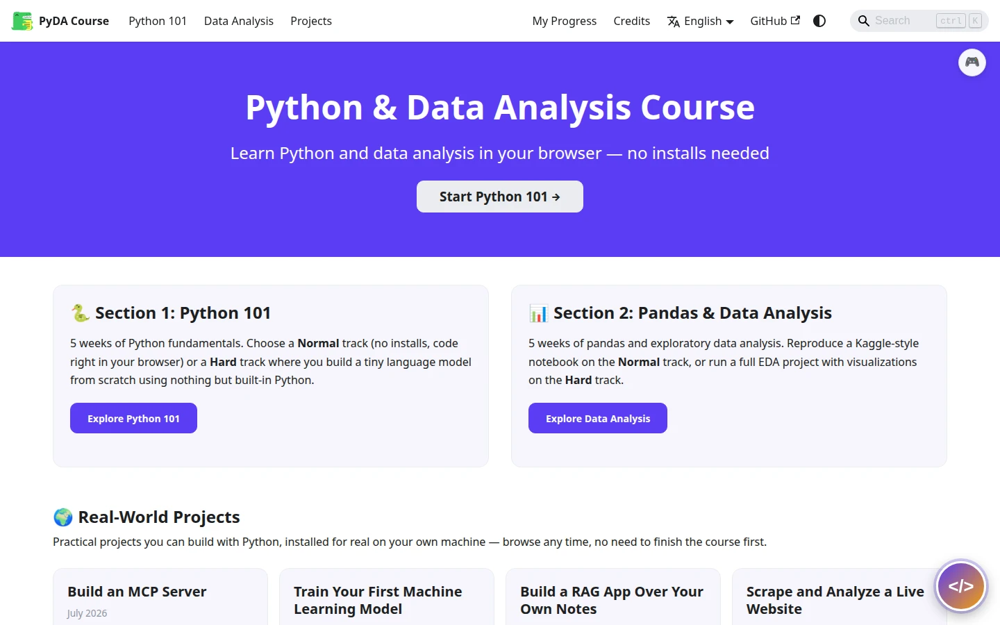
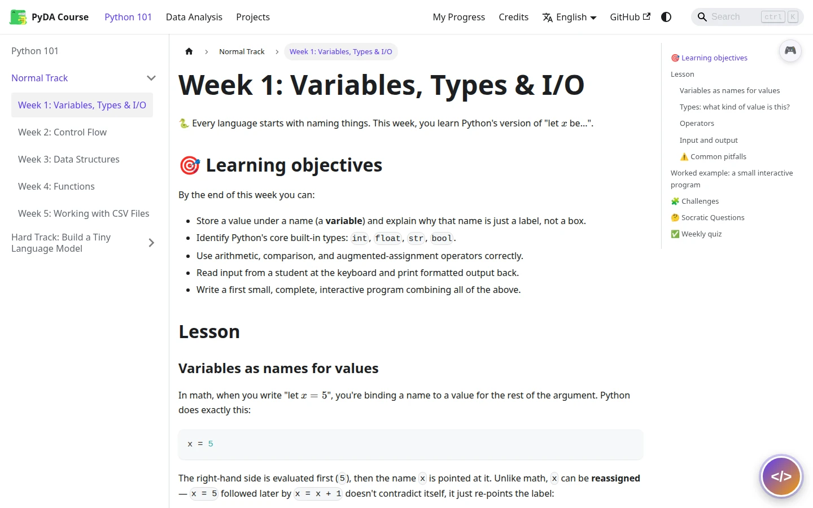
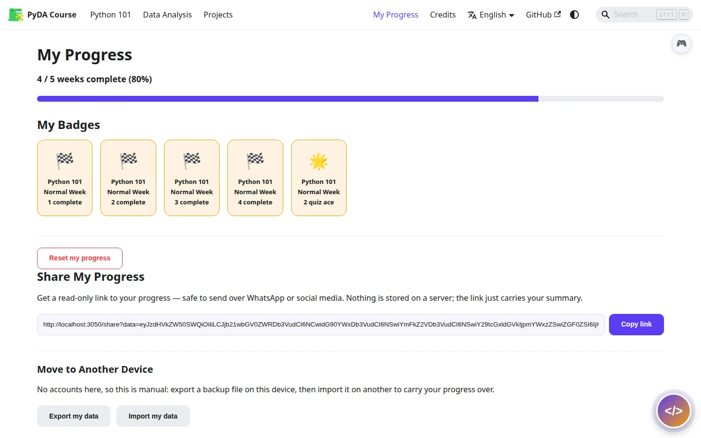
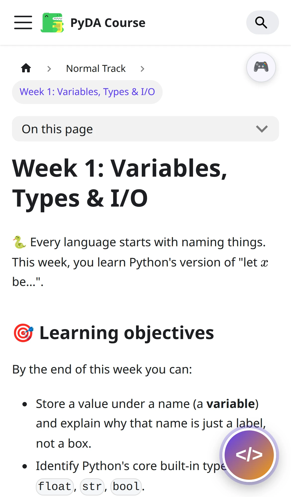

# Python & Data Analysis Course

[](https://github.com/abderrahim-lectures/python-data-analysis-course/actions/workflows/deploy.yml)
[](https://github.com/abderrahim-lectures/python-data-analysis-course/actions/workflows/ci.yml)
[](./LICENSE)
[](https://creativecommons.org/licenses/by/4.0/)
[](https://pyda-course.online/)
[](https://codespaces.new/abderrahim-lectures/python-data-analysis-course)

A free, browser-based Python and data analysis course — no installs required until you're ready to graduate to the real thing.

**🌐 [pyda-course.online](https://pyda-course.online/)**

- **Section 1: Python 101** (5 weeks) — fundamentals, with a Normal track and a Hard track (build a tiny language model from scratch, pure Python, deliberately no numpy).
- **Section 2: Pandas & Data Analysis** (5 weeks) — pandas basics reproducing a Kaggle-style notebook, with a Hard track doing a full exploratory data analysis project with visualizations.
- **Real-World Projects** — install Python locally for real with `uv` and build something the in-browser playground never could. New projects are added whenever a trending tool or framework is worth a hands-on write-up (e.g. building an AI agent with LangChain's `deepagents`, fine-tuning a small LLM with Unsloth) — browsable any time, not gated behind finishing the course.

Run entirely in the browser: every lesson's code is a runnable cell powered by Pyodide (Python compiled to WebAssembly) — hit ▶ Run and it executes right on the page, no install, no account. A dedicated [playground page](https://pyda-course.online/playground) offers a big scratch editor with a ⛶ "open in full-screen editor" button on every lesson cell. Each lesson also ships a generated `.ipynb` companion (see `notebooks/`) with one-click Colab/Kaggle/Binder/nbviewer/Deepnote badges for anyone who wants a real Jupyter environment, and bundled datasets (CSVs under `public/datasets/`, served via a manifest) are mounted into the in-browser filesystem automatically so `open('students-performance.csv')` just works. The site is installable as a PWA.

See [`plan/`](./plan/README.md) for the full design plan and rationale behind every major decision.

## Screenshots

| Homepage | Lesson + playground | Progress & badges | Mobile |
|---|---|---|---|
|  |  |  |  |

## Learning objectives

By the end of the course, a student can:

- Write Python programs using variables, control flow, data structures (lists, dicts, tuples, sets), and functions — without relying on classes or external libraries.
- Explain, from first principles, how a simple language model predicts text (tokenization → frequency counts → conditional probability → weighted sampling) by building one from scratch in pure Python (Hard track).
- Load, clean, filter, group, and aggregate real tabular data with pandas, and explain *why* vectorized tools exist by having personally measured pure Python's performance limits first.
- Run a complete, honest exploratory data analysis project — framing questions before charting, visualizing distributions and relationships appropriately, and stating a finding's confidence and caveats rather than overclaiming causation (Hard track).
- Install Python locally, manage a project with `uv`, and build a real project outside the browser playground (Real-World Projects — e.g. a minimal tool-calling AI agent, handling an API key as a secret).

## Pedagogical approach

- **Math-first framing.** The audience is math/data-analysis students, so new concepts are introduced in the notation they already know — a `for` loop via summation notation before syntax, a function as $f(x)$ before `def`, list comprehensions via set-builder notation — before showing the Python code.
- **Build, don't just read.** Both Hard tracks are project-based: a tiny language model built from nothing but the standard library, and a full EDA report on a real-shaped dataset. Struggling with plain Python's speed limits in Week 5 of Python 101 is the intentional setup for *why* pandas exists in Section 2.
- **Challenge + Socratic pattern, every week.** Each lesson pairs 🧩 **Challenges** (a concrete task with a collapsible answer you can self-check) with 🤔 **Socratic Questions** (open-ended, no answer provided — designed to make you reason about edge cases and *why*, not just *how*).
- **Always-on progress, never a wall.** A single gamified layer (XP, levels, streaks, quests, badges, activity log — all in one `localStorage` blob) marks progress as you go, but it never gates access: every lesson, challenge answer, and project is free to read. There is no mode toggle and no hidden unlock; what the progress page shows in your browser is the whole picture.
- **Honest, not hyped.** The EDA track explicitly teaches correlation-vs-causation and chart-honesty practices (truncated axes, cherry-picked ranges) as core material, not a footnote. With no backend, progress lives in your own browser and there is no certificate — the shareable unit is the content itself (permanent URLs, notebook badges), not a per-student snapshot.
- **Zero-install first, real install as a reward.** Every core week runs in-browser via Pyodide (Python compiled to WebAssembly). Installing Python for real is saved for the real-world projects, once fundamentals are solid enough to make that step feel like graduation rather than a chore.

## Development

```bash
npm install
npm run dev       # local dev server
npm run build     # production build
npm run preview   # preview the production build
npm run check     # astro check — reserves a fresh content cache first; must be 0 errors
npm run typecheck # tsc --noEmit
npm run test          # unit tests (vitest, tests/unit)
npm run test:e2e      # CDP smoke suite (tests/e2e/smoke.mjs, run against the built site)
npm run test:hreflang # alternate-link integrity (pure HTTP, against a preview server)
npm run test:contrast   # automated color-contrast check
npm run test:responsive # mobile-viewport rendering check
npm run test:a11y       # accessibility smoke check
```

Every lesson's runnable cells execute in-browser via Pyodide (loaded from the jsdelivr CDN at runtime). Lesson notebooks under `notebooks/` are generated by `scripts/generate-notebooks.mjs` and committed; `public/datasets/index.json` is the manifest that maps the dataset names lessons reference to the CSV files bundled under `public/datasets/`.

### Internationalization

The site's UI is bilingual-to-quadrilingual: page chrome (nav, home, learn hub, credits, cheatsheets, lesson completion labels…) is translated through [Paraglide](https://inlang.com/m/gerre34r/library-inlang-paraglideJs) into en/ar/es/fr. Source strings live in `messages/{en,ar,es,fr}.json`; generated code lands in `src/paraglide/` (gitignored) and is produced by `npx paraglide-js compile` (run automatically by `astro build`/`astro dev`). `tests/unit/i18n.test.ts` enforces per-locale key parity, non-empty values, and that non-English locales are genuinely translated.

Content coverage: project write-ups, lesson/module body content (49 lessons + 22 modules), and the cheatsheet reference cards are fully translated into ar/es/fr. Locale routing lives in `src/lib/routeSegments.ts`; see `plan/i18n-migration.md` for the design.

### Building from a clean checkout

`npm run build`/`npm run dev` run the `prebuild`/`predev` hooks first, in order: `scripts/reset-astro-cache.cjs` (clears the stale content-collection cache that can silently omit recent edits), `scripts/apply-lix-patch.cjs`, and `scripts/generate-project-slugs.cjs`. The lix patch guards a known upstream defect: on a fresh project the inlang compiler writes ~500 entities in one database transaction and the commit fails (lix issue #422, no released fix at `@lix-js/sdk@0.15.1`). The script splits the fresh import into chunked commits and is a no-op when already patched. If the installed SDK changes shape and the patch no longer applies, the build fails loudly instead of producing a half-written project — port the patch to the new layout rather than deleting the guard.

### Codespaces

The badge above opens a ready-to-go [GitHub Codespace](https://github.com/features/codespaces) (Node + Python + `uv` preinstalled, via [`.devcontainer/devcontainer.json`](./.devcontainer/devcontainer.json)) — no local setup needed to start contributing.

### Real-world project examples

[`examples/ai-agent/`](./examples/ai-agent/) is a real, runnable copy of the agent built in the [Build an AI Agent](https://pyda-course.online/projects/ai-agent/) project — see its own README for how to run it (locally with `uv run python agent.py`, or directly in Codespaces). Each project gets its own `examples/<slug>/` folder.

Most projects also ship a `notebook.ipynb` alongside their example code, with one-click Colab/Kaggle/Binder badges on the project's own page ("Where to run this") — a lower-setup way to try a project before committing to a local `uv` install. Every project now has per-locale notebooks (`notebook.{ar,es,fr}.ipynb`) generated from each locale's markdown; each locale's badge block points at its own localized notebook. The root-level [`requirements.txt`](./requirements.txt) pre-installs the packages these notebooks need so MyBinder launches build a shared, cached environment instead of reinstalling from scratch every time.

[`examples/finetune-llm-unsloth/`](./examples/finetune-llm-unsloth/) is the local companion to the [Fine-tune a Small Language Model](https://pyda-course.online/projects/finetune-llm-unsloth/) project — dataset prep and local inference scripts; the fine-tuning step itself runs on a free Colab/Kaggle GPU notebook, linked from the project.

[`examples/rag-notes/`](./examples/rag-notes/) is the companion to the [Build a RAG App](https://pyda-course.online/projects/rag-notes/) project — local embeddings with `sentence-transformers`, a NumPy similarity search, and a free-tier LLM call for the final answer.

[`examples/mcp-server/`](./examples/mcp-server/) is the companion to the [Build an MCP Server](https://pyda-course.online/projects/mcp-server/) project — a FastMCP server exposing two tools, ready to connect to Claude Desktop or another MCP client.

[`examples/scrape-analyze/`](./examples/scrape-analyze/) is the companion to the [Scrape and Analyze a Website](https://pyda-course.online/projects/scrape-analyze/) project — scrapes a real, scraping-friendly site with `requests`/BeautifulSoup, then cleans and charts the results with pandas/matplotlib. No API key needed.

[`examples/ml-classifier/`](./examples/ml-classifier/) is the companion to the [Train an ML Classifier](https://pyda-course.online/projects/ml-classifier/) project — trains and compares two scikit-learn classifiers on the course's own Titanic dataset.

[`examples/student-projects/`](./examples/student-projects/) is a gallery of real-world projects students have built — its README walks complete git beginners through forking, branching, and opening a PR to add their own.

## Contributing

Every change — a lesson, a component, a bug fix, a translation — goes through the same flow:

1. **Open an issue** describing the change, labeled by type (`type:feature`, `type:bug`, `type:content`, `type:infra`, `type:i18n`) and area (`area:python-101`, `area:data-analysis`, `area:playground`, `area:gamification`, `area:design`).
2. **Branch off `main`** (`issue-<number>-<short-slug>`) and do the work there.
3. **Open a PR** referencing the issue (`Closes #N`), with `npm run build` (and `npm run test:e2e` for anything touching interactive components) passing.
4. **CI runs automatically** on the PR — typecheck (`astro check`), build, and the unit + CDP smoke suites.
5. Once checks pass, the PR merges into `main` and the [deploy workflow](./.github/workflows/deploy.yml) publishes the update.

Found a typo or a broken example while going through a lesson? Lesson content lives in `src/content/lessons/` (and `src/content/projects/` for the Real-World Project pages) — the fastest fix is a PR against that file.

**Ways to contribute:**
- **Content**: write or improve a week's lesson, challenges, or socratic questions — see [`plan/content-pattern.md`](./plan/content-pattern.md) and [`plan/content-style-guide.md`](./plan/content-style-guide.md) for the expected structure and tone.
- **Translations**: the whole surface — UI chrome plus lesson, module, project, and cheatsheet body content — is translated for Arabic, Spanish, and French. UI strings live in `messages/{en,ar,es,fr}.json` (compiled by [Paraglide](https://inlang.com/m/gerre34r/library-inlang-paraglideJs) into `src/paraglide/`), route segments in `src/lib/routeSegments.ts`, translated project content under `src/content/projects/<locale>/`. Project URLs are localized per locale (e.g. `/es/proyectos/catalogo-de-datos`) — the English slug still resolves as a canonical alias. A `type:i18n` PR fixing or improving an existing translation is welcome.
- **Components/infra**: bug fixes, accessibility improvements, and performance work on the playground, gamification, or sharing features.

Please don't open a PR without a linked issue first for anything non-trivial — it avoids duplicated or conflicting work.

## License

Code is MIT-licensed (see [`LICENSE`](./LICENSE)); course content is additionally available under CC-BY 4.0. Third-party datasets and tools are credited on the site's [Credits page](https://pyda-course.online/credits).

---

Created by [Abderrahim Adrabi](https://github.com/abderrahim-lectures).
